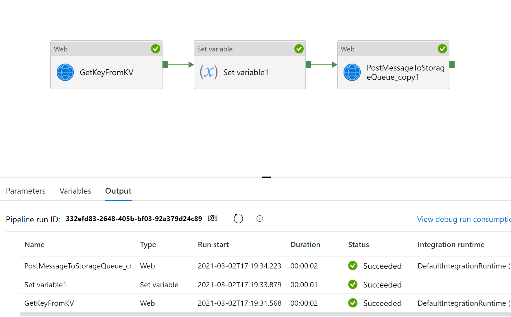
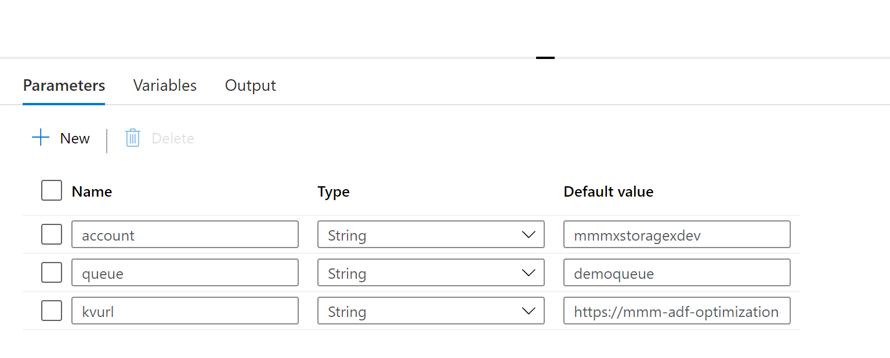
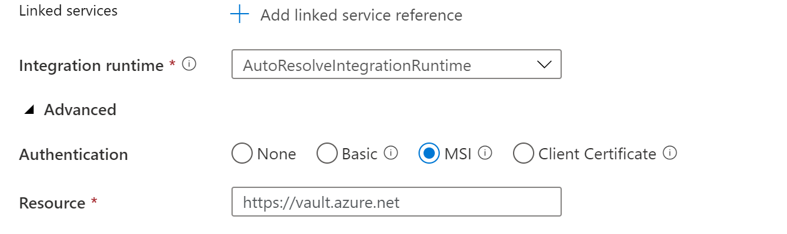
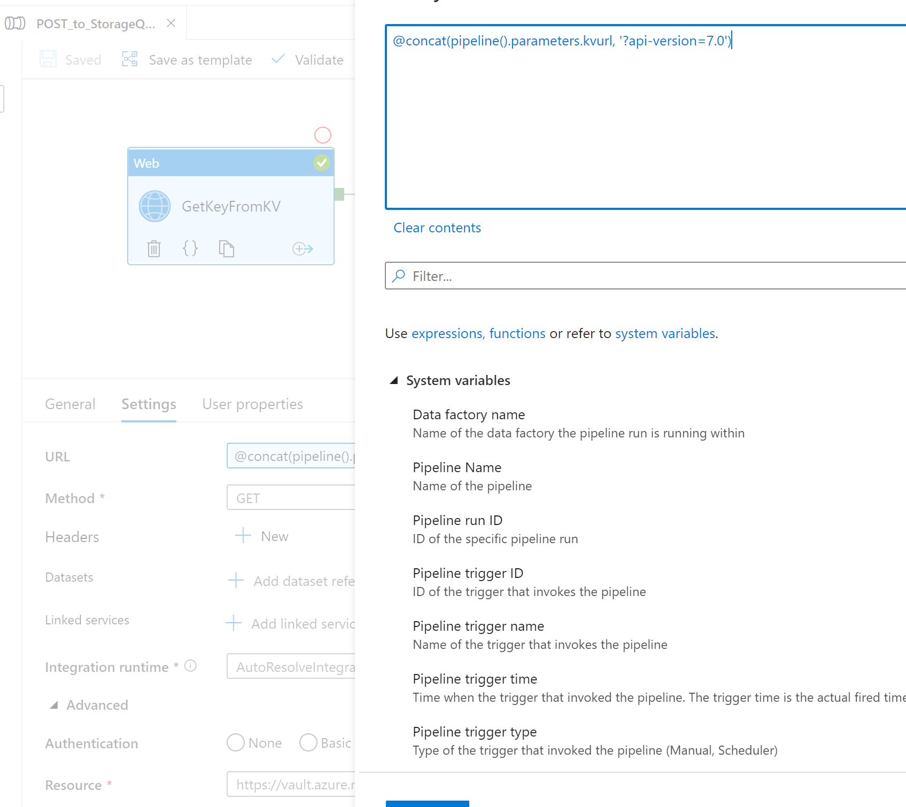
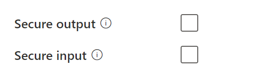
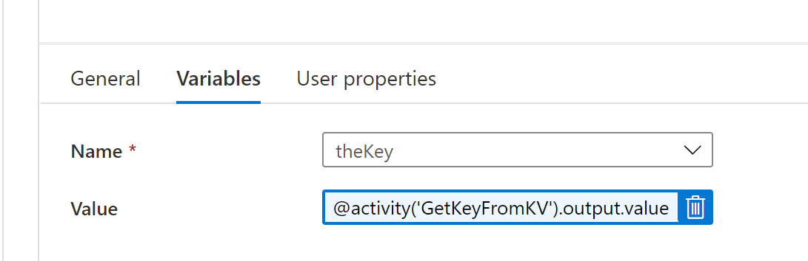
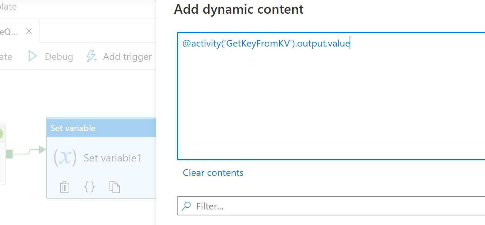
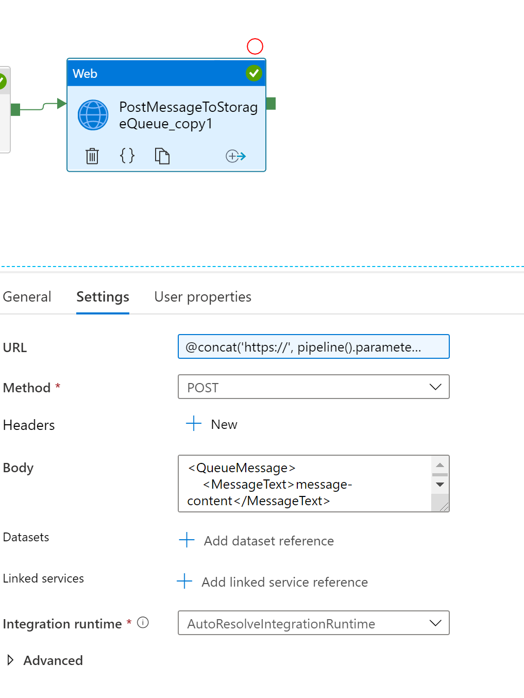

## Writing to a Storage Queue Securely from ADF.



### Steps:

1.  Retrieve SAS Key from Key Vault.

2.  Set a variable to hold that value (technically not needed, but makes things)
    clean

3.  Post to the Storage Queue


### 1. Retrieve SAS key from Key Vault.

Reference Document: [Use Azure Key Vault secrets in pipeline activities - Azure
Data Factory \| Microsoft
Docs](https://docs.microsoft.com/en-us/azure/data-factory/how-to-use-azure-key-vault-secrets-pipeline-activities)

For a secret stored in key vault – each version will have a url, so be sure to
grab the version specific url.

For this pipeline, I create a few parameters


|Parameter Name | Value| Example |
------ | ------ | ------ 
|account   | storagename  | mmmxstoragexdev |
|queue | queue name| demoqueue|
|kvurl | url for key vault secret| sv=2020-02-10&ss=.....|

*Note* the SAS Key - remove the ? when you store it in keyvault.



We will make a Web request that is a get. For this to work with MSI
authentication, be sure to provide access to your ADF Instance in your key vault
instance.



We will be sure to add the api version to the url - as shown below.



The Web Request is a GET, the url 

```
@concat(pipeline().parameters.kvurl,'?api-version=7.0')
```
The Resource is:
```
https://vault.azure.net
```

After you get it going, you should set the Secure output for the key so it won't show up in the logs



### 2.  Set a variable to hold that value (technically not needed, but makes things clean

Be sure to grab the output value and place into a variable.



```
@activity('GetKeyFromKV').output.value
```




### 3.  Post to the Storage Queue

Create a web activity  - set the Url, Body is the queueMessage (this is a post)

**For the URL**
```
@concat('https://',  pipeline().parameters.account, '.queue.core.windows.net/', pipeline().parameters.queue, '/messages?visibilitytimeout=30&timeout=30','&', variables('theKey'))
```

Reference Document: (https://docs.microsoft.com/en-us/rest/api/storageservices/put-message)<https://docs.microsoft.com/en-us/rest/api/storageservices/put-message>


